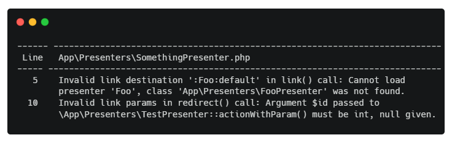

# Nette Framework link validation for PHPStan

[](https://github.com/phpstan/phpstan-nette/actions)
[](https://packagist.org/packages/phpstan/phpstan-nette)

* [PHPStan](https://phpstan.org/)
* [Nette Framework](https://nette.org/)

Check links in your Nette Framework applications using PHPStan.



## Features
* Validate parameters passed to `link()`, `lazyLink()`, `redirect()`, `redirectPermanent()`, `forward()`, `isLinkCurrent()` and `canonicalize()` methods
* Works for presenters, components and 'LinkGenerator' service
* Checks if passed destination is valid and points to existing presenter, action or signal
* Checks if passed link parameters are valid and match relevant `action*()`, `render*()` or `handle*()` method signature
* Checks also links to sub-components of known types (`createComponent*()` method must exists)

## Installation

To use this extension, require it in [Composer](https://getcomposer.org/):

```
composer require --dev metisfw/phpstan-nette-links
```

If you also install [phpstan/extension-installer](https://github.com/phpstan/extension-installer) then you're all set!

<details>
  <summary>Manual installation</summary>

If you don't want to use `phpstan/extension-installer`, include extension.neon in your project's PHPStan config:

```
includes:
    - vendor/metisfw/phpstan-nette-links/extension.neon
```

To perform framework-specific checks, include also this file:

```
    - vendor/metisfw/phpstan-nette-links/rules.neon
```

</details>

## Configuration

Either `applicationMapping` or `containerLoader` (for automatically loading mappings from `PresenterFactory` service in your app) must be set for link checking to work.

If you use non-standard `PresenterFactory` this feature might not work because logic for mapping presenter name (e.g. `MyModule:Homepage`) to presenter class (e.g. `\App\Presenters\MyModule\HomepagePresenter`) and vice versa would work differently.

If you use `containerLoader` you might solve this by implementing method `unformatPresenterClass` in your custom `PresenterFactory` class. This method should return presenter name for given presenter class.

Or you can create custom implementation overriding `PHPStanNetteLinks\Nette\PresenterResolver` service and replace it in your PHPStan config:

```neon
services:
    nettePresenterResolver:
        class: MyCustom\PresenterResolver
```

### containerLoader

Container loader can be used to create instance of Nette application DI container.

Example:
```neon
parameters:
    netteLinks:
        containerLoader: './containerLoader.php'
```

Example `containerLoader.php`:

```php
<?php

return App\Bootstrap::boot()->createContainer();
```

### applicationMapping

Application mapping is used to map presenter identfiers to classes in link checking.

Example:
```neon
parameters:
    netteLinks:
        applicationMapping:
            *: App\Presenters\*\*Presenter
```
