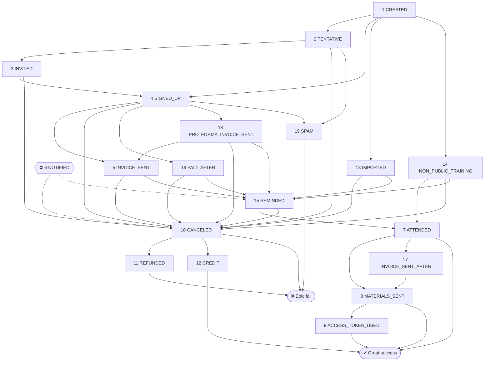

```mermaid
flowchart TD
	1[1 CREATED]-->2
	1-->4
	1-->13
	1-->14
	2[2 TENTATIVE]-->3
	2-->10
	2-->19
	3[3 INVITED]-->4
	3-->10
	4[4 SIGNED_UP]-->5
	4-->10
	4-->16
	4-->18
	4-->19
	5[5 INVOICE_SENT]-->10
	5-->15
	6{{"⛔ 6 NOTIFIED"}}-.->10
	6-.->15
	7[7 ATTENDED]-->8
	7-->17
	7-->SUCCESS(["✔ Great success"])
	8[8 MATERIALS_SENT]-->9
	8-->SUCCESS
	9[9 ACCESS_TOKEN_USED]-->SUCCESS
	10[10 CANCELED]-->11
	10-->12
	10-->FAIL(["❌ Epic fail"])
	11[11 REFUNDED]-->FAIL
	12[12 CREDIT]-->SUCCESS
	13[13 IMPORTED]-->10
	13-->15
	14[14 NON_PUBLIC_TRAINING]-->7
	14-->10
	14-->15
	15[15 REMINDED]-->7
	15-->10
	16[16 PAID_AFTER]-->10
	16-->15
	17[17 INVOICE_SENT_AFTER]-->8
	18[18 PRO_FORMA_INVOICE_SENT]-->5
	18-->10
	18-->15
	19[19 SPAM]-->FAIL
```
